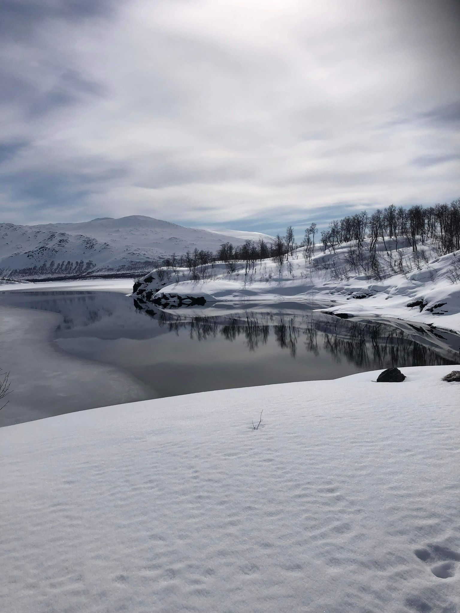
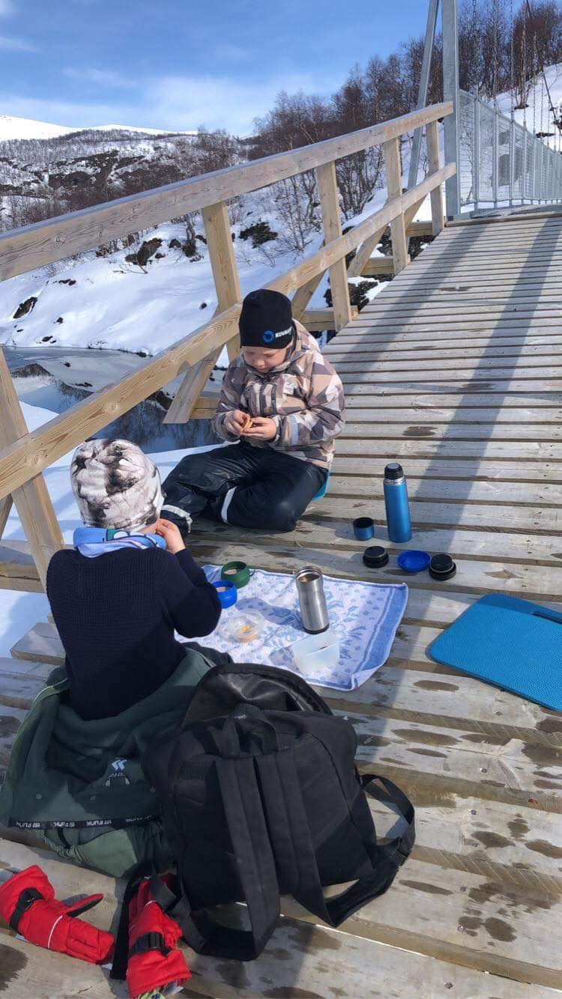
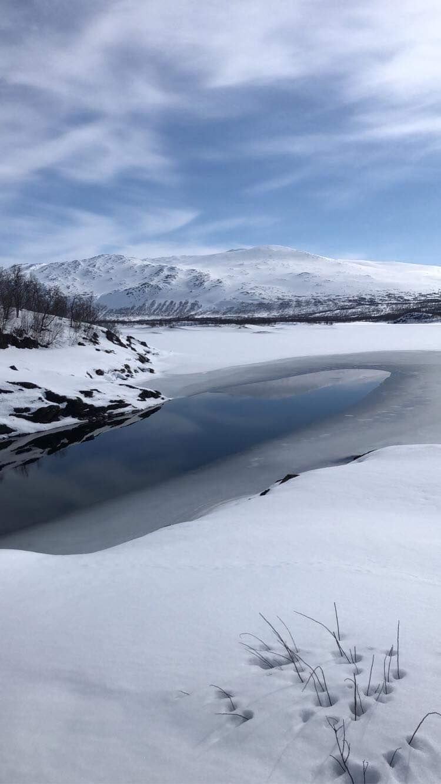
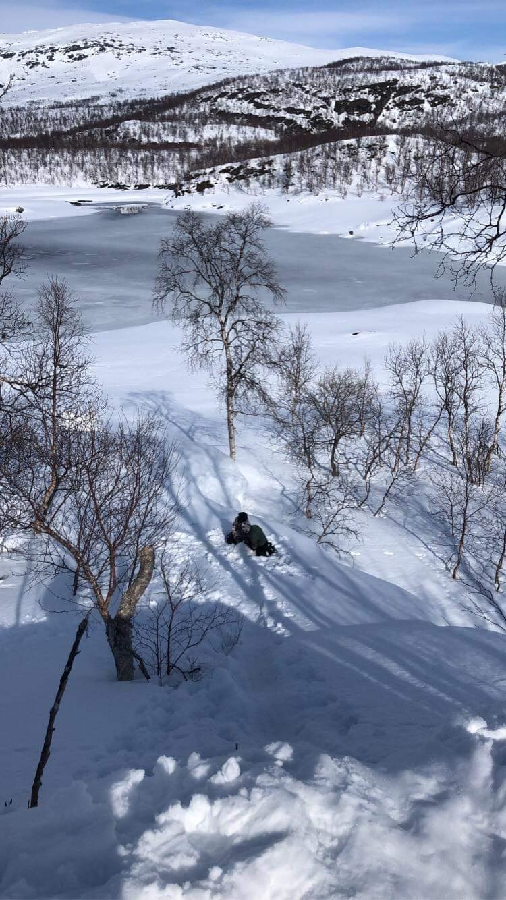
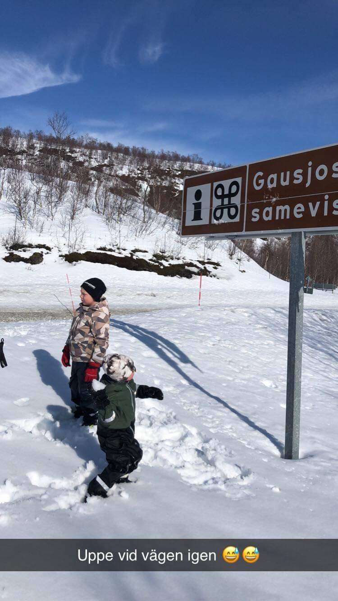
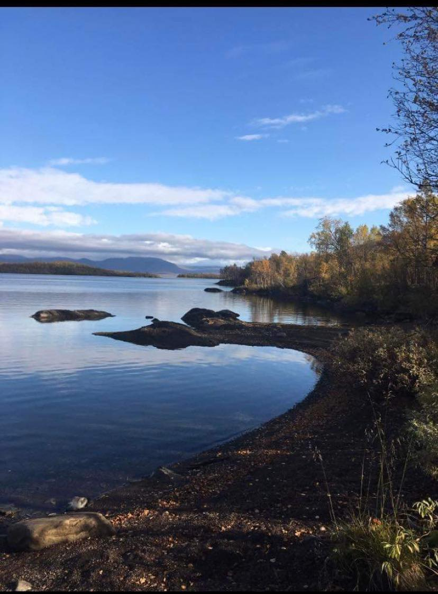

Nu när sommaren närmar sig med stormsteg och man med lätthet kan gå eller cykla till de flesta zoner utan större hinder kom jag att tänka på en zon som blev mer än bara en vanlig zontagning.

Under sportlovet när jag och mina två barnbarn befann oss uppe i fjällen dök det plötsligt upp en ny zon bara några kilometer bort. Självklart började jag direkt fundera på hur vi skulle kunna ta oss till zonen och om det ens skulle vara möjligt med två barn i åldern 7 och 4,5 år. Zonen Gausjosjöbron ligger efter en vandringsled upp till ett sameviste. Absolut inga problem under den snöfria tiden på året, men när snötäcket ligger tjockt och snön vräker ner är det en större utmaning.

En eftermiddag någon dag senare slutade snön vräka ner och då såg jag möjligheten. Vi packade fikasäcken och skidorna i bilen och begav oss västerut efter Blå vägen, ca 5 kilometer. Bilen parkerades i närmaste parkeringsficka och sedan bar vi skidorna upp till nedfarten. När vi lyckats ta oss upp för den höga plogkanten och fått på oss skidorna började äventyret med att ta oss fram till zonen. Jag hade berättat för grabbarna att det var en ny zon vi skulle ta och att ingen hade gjort det tidigare. Då sa äldsta barnbarnet Mormor, menar du att vi är först i hela världen med att ta zonen? Då måste vi ta den! Med motivationen i topp började vi så vår skidfärd. Det var tungåkt och vi lämnade djupa skidspår efter oss. Efter 45 minuters kämpande i djupsnön, samt en och annan vurpa, kom vi fram till hängbron där zonen ligger. Skidorna togs av och vi gick ut på bron och tog zonen. Först av alla i hela världen!

Det var kallt och blåsigt så efter en värmande fikapaus spände vi på oss skidorna igen och återvände till bilen efter avklarat uppdrag.

Sex veckor senare var det dags för ännnu en skidtur till zonen efter grabbarnas önskemål om en dagsutflykt till Gausjosjö. Den här gången hade vi verkligen vädret på vår sida, men plusgraderna gjorde att skidföret även denna gång var av det tyngre slaget. Men med glada miner kämpade vi oss än en gång fram till hängbron! När skidorna åkt av och vi tagit oss över bron var det gott med fika i solskenet. Efter fikat började grabbarna leka i snön, gjorde långa rutschkanor och susade på galonbyxorna nerför backen.

Solen sken, magiska vyer och glada skratt från lekande barn innebar att tiden bara flög iväg. Efter några underbara timmar var det så dags att packa ihop och bege oss tillbaka till stugan. Vi var alla tre överens om att vi hade haft en helt fantastisk dag. En utflykt som förmodligen inte blivit av vintertid om det inte kommit en zon dit.

Jag har vandrat upp till Gausjosjö sameviste ett par gånger innan, både sommar och höst, och kan varmt rekommendera att ta sig tiden att gå hela vägen fram till samevistet. Totala sträckan från vägen till samevistet är 2,5 kilometer och uppskattningsvis ligger zonen en kilometer innan samevistet. Sträckan bjuder på många fantastiska vyer och nu dessutom en zon!

/Brellir

